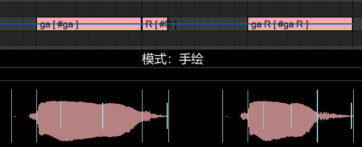
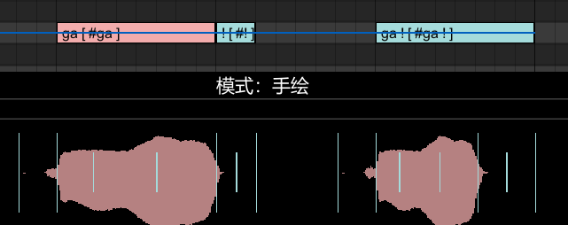
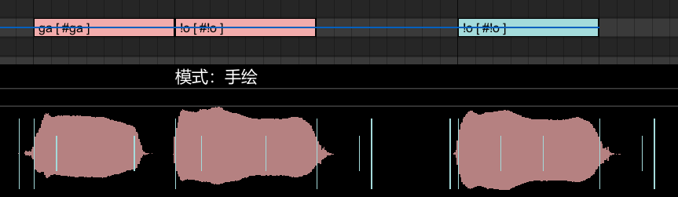
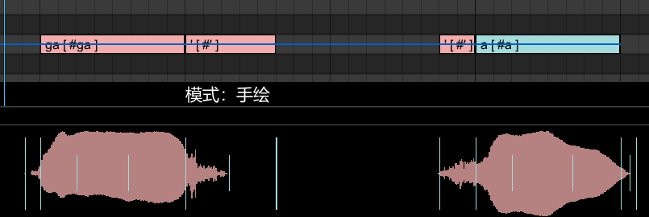

# 特性列表
## 音阶
目前版本包含A3、F3、D4、G4四个音阶。如需修改音阶映射，可自行从VocalSharp官网下载开发套件，用srdxtool打开文件夹内的Milk JPN x.x.x.srdx文件。

## 常规音素
使用VCV录音表，支持平假名和罗马音输入。

## 特殊音素
### 语尾息 R
支持所有发音，在音符后面加一个R音符，或使用“发音 R”。例如`ga` `R`或`ga R`

### 喉塞音 !
有两种调用方式：
- 句尾调用：在音符后面加一个"!"音符，或使用“发音 !”

- 句中调用：“!元音”，例如`!a` `!i` `!u` `!e` `!o`

### 气泡音 '
- 句尾调用：在音符后面加一个"'"音符，或使用“发音 '”
- 开头调用：在音符前面加一个"'"音符，仅支持元音
